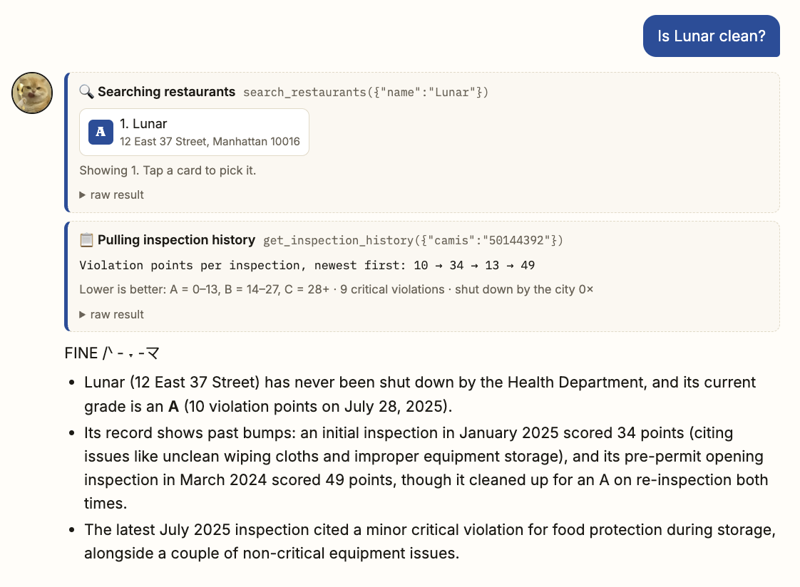
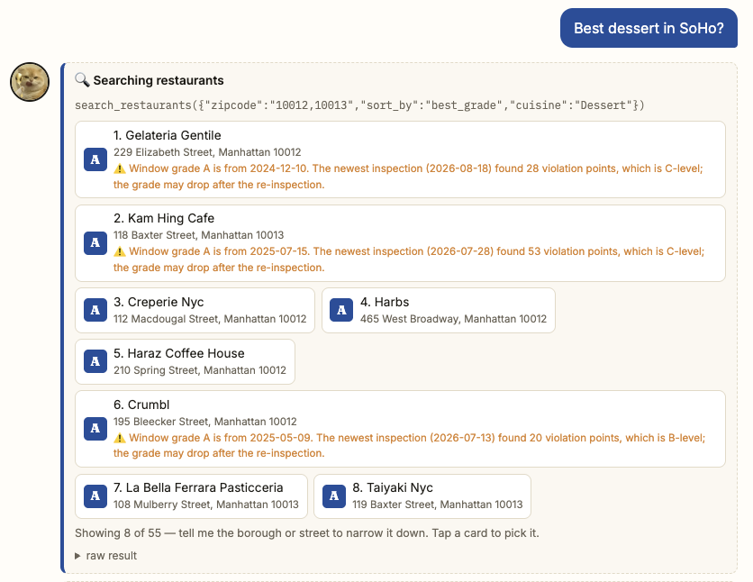
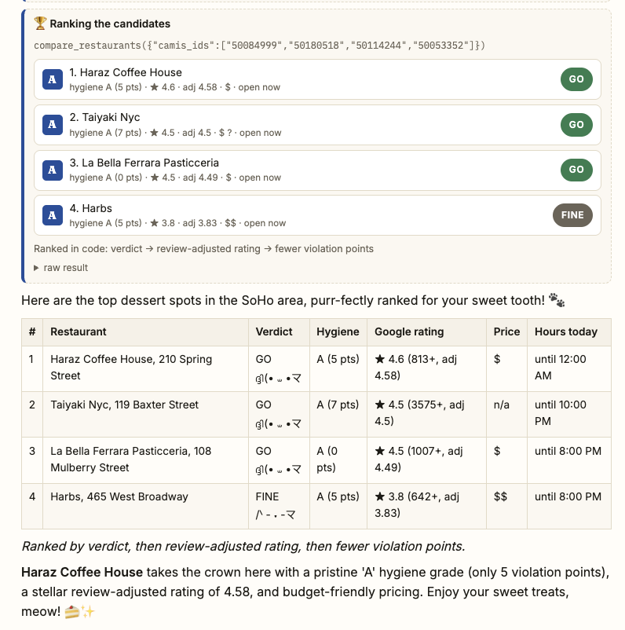
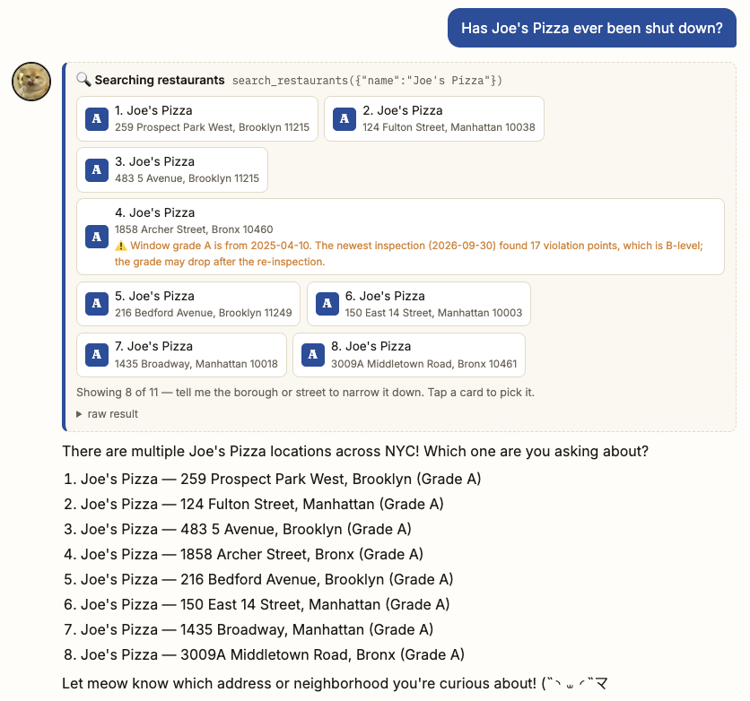
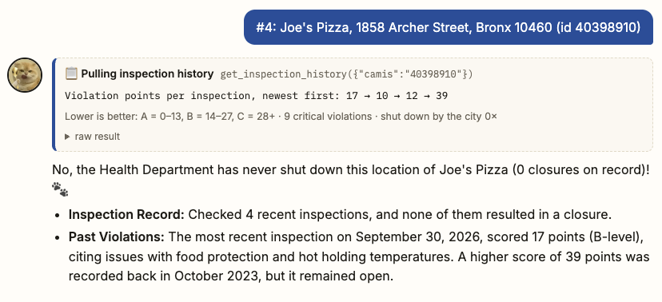
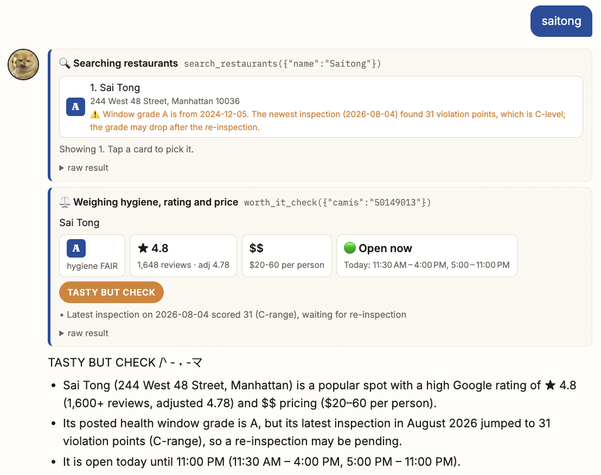
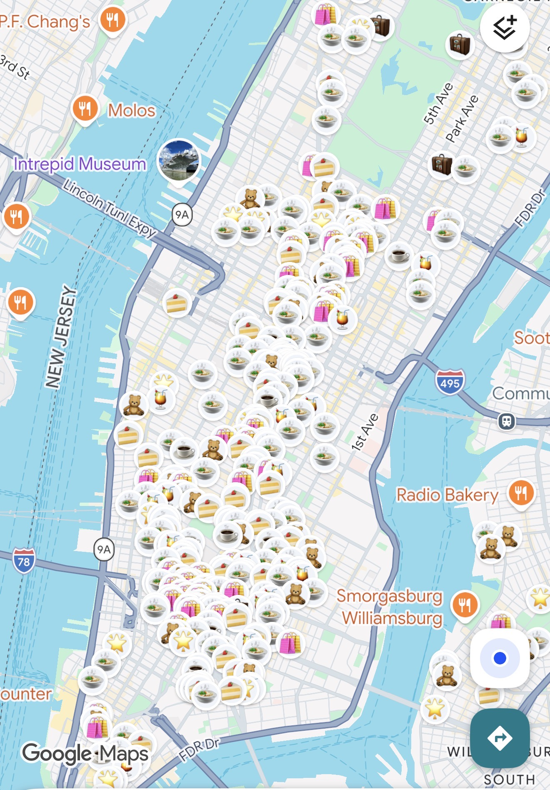

# Eat or Not? 🍴🐱

**Ask Meowchi, a mochi-loving New Yorker cat, whether a NYC restaurant is worth eating at (˵◝ ⩊  ◜˵マ**

## Who it's for and what it does

For anyone in New York (say, a Columbia student) deciding where to eat tonight.

Every NYC restaurant posts a letter grade in its window, but the grade hides a lot: an "A" can be
months old while the newest inspection found 31 violation points, and a spotless kitchen can sit on a
block where city inspectors keep finding rats. Eat or Not? Meowchi reads the city's official inspection
records for you, adds what diners say on Google, what it costs and whether it's open right now, and
gives a clear verdict (GO, FINE, SKIP...) with the evidence behind it. Every tool call is shown above
the answer, so nothing is taken on faith.

## Tools

| Tool | What it does |
|---|---|
| `search_restaurants` | Finds restaurants by name, one or more zipcodes, cuisine and/or borough, with their current grade; flags when the posted grade is older than a worse newer inspection. |
| `get_inspection_history` | A restaurant's recent inspections: violation points, grade, every violation (critical or not) and any Health Department closures with dates. |
| `rat_risk_report` ⭐ | Rat risk (LOW / MODERATE / HIGH) from the restaurant's own pest violations plus city rodent inspections that found rats at other buildings within 150 m, reported as "inside the shop" vs. "the block". |
| `worth_it_check` ⭐ | Hygiene, Google rating (adjusted for review count), price and today's opening hours side by side, with a rule-based verdict. |
| `compare_restaurants` ⭐ | Runs the worth-it check on 2–5 places and returns them already ranked in code (verdict → adjusted rating → fewer violation points), so the order never depends on the model's taste. |

⭐ original tools. Data: NYC Open Data
([Restaurant Inspections](https://data.cityofnewyork.us/Health/DOHMH-New-York-City-Restaurant-Inspection-Results/43nn-pn8j/about_data),
[Rodent Inspections](https://data.cityofnewyork.us/Health/Rodent-Inspection/p937-wjvj/about_data); no key needed) and the
[Google Places API (New)](https://developers.google.com/maps/documentation/places/web-service/text-search).

## How to use it

Open the app and type into the chat box, or tap one of the three example buttons under Meowchi's
greeting. You don't need special phrasing:

- **Just a restaurant name** works: `Lunar`, `Sai Tong`. Names aren't case- or space-sensitive, so
  `saitong` finds "Sai Tong" and `joes pizza` finds "Joe's Pizza". An exact name wins over partial ones.
- **Add a location to jump straight to the right branch:** `Sapps Columbia`, `Heytea Broadway`,
  `Joe's Pizza Carmine St`. A neighborhood, street or landmark narrows the search, so Meowchi doesn't
  have to ask which location you mean.
- **Or ask a question:** *Is Heytea on Broadway open now?* · *Do you recommend Pranakhon?* ·
  *Cheap clean ramen in the East Village?*
- **Several places match?** They appear as numbered cards. Tap one (or reply with a borough or
  street) and Meowchi answers your original question for that location.
- **Follow-ups work.** Each conversation is remembered ("what about the other one?").
  **New chat** starts over.
- **What do the numbers mean?** Open **📏 How to read the numbers** above the chat.
- **Times are New York time.** "Open now", "tonight" and today's hours are always checked against the current time in New York (America/New_York), wherever you or the server are.

### Three example queries

**1. Is Lunar clean?**
Finds Lunar and explains its inspection history in plain words: rough early inspections (49, then
34 violation points), an A with 10 points now, and never shut down.



**2. Best dessert in SoHo?**
Turns "SoHo" into its zipcodes and searches both in one call (`"10012,10013"`), sends the top
candidates to `compare_restaurants`, which ranks them in code, and answers with a table in exactly
that order (the screenshot at the top shows the result).




**3. Has Joe's Pizza ever been shut down?**
Joe's Pizza has 11 locations, so Meowchi lists them as tappable cards and asks which one. After you
pick, it answers the original question: Health Department closures for that branch.




**Extra Example: `saitong`.** The name is standardized to find "Sai Tong", a 31-point newer inspection is
flagged even though the window shows an A, and the 4.8★ rating from 1,600+ reviews gives
**TASTY BUT CHECK**.



## How the scores work

| Metric | Meaning |
|---|---|
| **Violation points** | Added by the city inspector per problem found. **Lower is better:** A = 0–13, B = 14–27, C = 28+. A first inspection with 14+ points isn't graded until a re-inspection, so an old grade can stay in the window; the app flags this. |
| **Rat-risk points** | Our heuristic, **lower is better** (0–2 low, 3–5 moderate, 6+ high). Inside the shop (last 3 years): rats +4, mice +2, roaches/flies +1, pest-friendly conditions +1. The block (last 12 months, other buildings within 150 m): 1–10 / 11–40 / 40+ rat findings → +1 / +2 / +3, plus +1 if over 30% of those inspections found rats. |
| **Adjusted rating** | Bayesian average `(n·rating + 50·4.2) / (n + 50)`, the IMDb Top 250 method, so a 5.0 from 6 reviews (→ 4.29) can't beat a 4.7 from 2,000 (→ 4.69). |
| **Verdict** | Rules, not a blended score; hygiene is a gate, never averaged with taste. Grade C, a closure in the last year, or weak reviews → **SKIP** · clean and well-loved → **GO** ($) or **GO IF SPLURGING** ($$ and up) · hygiene FAIR (grade B, a closure in the last 3 years, or a newer 28+ inspection) but excellent reviews → **TASTY BUT CHECK** · rating or grade missing → **NOT ENOUGH DATA** · otherwise **FINE**. Unknown prices are never treated as expensive. |
| **Ranking** | Computed by `compare_restaurants`: verdict first, then higher adjusted rating, then fewer violation points. The model only copies the order. |

## Setup

You need a Google Cloud project with billing (the course credits work) and two APIs enabled:

1. **Agent Platform API** (formerly Vertex AI), which runs Gemini. Then authenticate once:
   `gcloud auth application-default login`
2. **Places API (New)** for ratings, prices and hours. In *APIs & Services → Credentials*, create an
   API key and restrict it to Places API (New).

### Run locally

1. Create a file named **`.env`** next to `app.py` containing one line:
   ```
   GOOGLE_PLACES_API_KEY=your-key-here
   ```
   (`.env` is git-ignored, so the key never reaches GitHub. `export GOOGLE_PLACES_API_KEY=...` also works.)
2. Run `uv run app.py`. The terminal confirms `✅ Google key loaded` (or warns if it isn't), and the
   browser opens http://localhost:8000 automatically.

Without the Google key the app still works from city data; ratings, prices and hours show as n/a.
**Troubleshooting:** open `/health` (e.g. http://localhost:8000/health) to see whether the server has
the key and what Google answers to a test search.

### Deploy (Cloud Run)

Continuous deploy from GitHub with a buildpack and this entrypoint:

```
uvicorn app:app --host 0.0.0.0 --port $PORT
```

In the service settings, add the environment variable **`GOOGLE_PLACES_API_KEY`**, and set
**maximum instances = 1** (conversations are kept in memory). Check `https://<your-url>/health` after
deploying.

## Following the tool-writing guidance from lecture

- Every tool and argument has a description with examples; `borough` and `sort_by` are enums.
- The model passes only restaurant IDs; the code looks up coordinates, matches the right Google
  listing (standardized name + under 150 m away), computes scores and does the ranking.
- Errors are JSON the model can act on (e.g. a name passed instead of an ID returns *"…is not a
  restaurant ID. Call search_restaurants first"*); throttled Google calls are retried.
- Results are trimmed (8 restaurants max, a few inspections, short violation text) to keep context small.

## Project structure

```
app.py          harness: run_agent() tool loop, Meowchi's system prompt, sessions, /chat, /health
tools.py        the five tools, their JSON descriptions (TOOLS) and run_tool()
index.html      frontend: greeting, tool-call cards, tappable results, ranking card, legend
static/         vendored marked (Markdown tables) + DOMPurify (sanitizing)
logo.png, meowchi.jpg, screenshots/
submission.json deploy URL and authors
```

Model: `vertex_ai/gemini-3.5-flash-lite` (location `global`) through LiteLLM.


## Fun fact 🐾

I built this because I'm a big foodie. I also love cats and discovering the city. Here's my own Google Map full of places I've saved and now Meowchi can definitely check them before I go ٩(^ᗜ^ )و ´-


